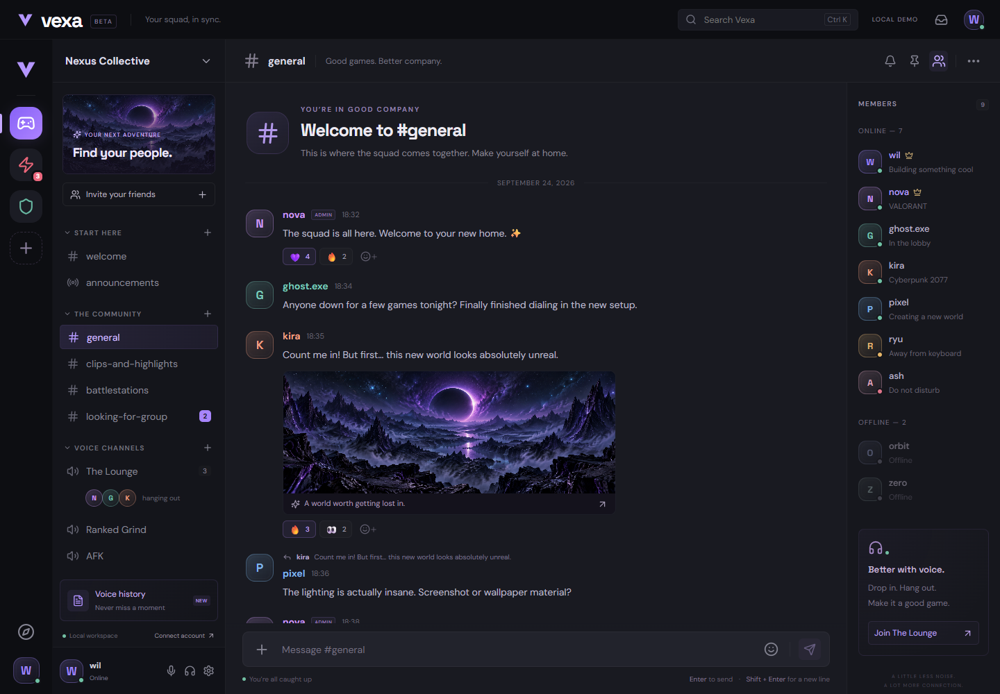

# Vexa

**Your squad, in sync.** A gamer-focused community workspace with a dark violet interface, original space artwork, responsive navigation, and an extensible TypeScript backend.



## What this pass delivers

Two intentionally separate modes:

- **Local demo:** an immediately usable product preview with device-local servers/channels, messages, safe Markdown, replies, edits/deletion, reactions, pins, search, local attachments (1 MB), profile preferences, friends/DM interactions, and a searchable sample voice transcript. This is not a multi-user service. Sample people, presence, badges, and voice participants are illustrative.
- **Connected workspace:** real cookie-based accounts, Postgres guilds/channels and messages, Redis/WebSocket delivery, reconnect/resume, optimistic sends with nonce reconciliation and failed-message retry, message edits/deletion/replies, pagination, typing, read-state writes, member lists, and full-text search. Click **Connect account → Open connected workspace** after starting the backend.

The shared package includes Zod contracts, 64-bit Snowflake IDs, permission bitfields, and tested overwrite precedence. Every channel API access and gateway dispatch checks server-side permissions. React uses TanStack Query for connected data and Zustand for the isolated local demo. The demo message list uses TanStack Virtual; connected history is paginated and still needs virtualization for long sessions.

**This is a first implementation pass, not a finished Discord replacement.** Real voice/video/screen share, transcription workers, full social/moderation APIs, production uploads/embeds, comprehensive denial coverage, observability and measured scale remain open. No audio is captured by the voice preview. No performance numbers are claimed.

## Quick start: interface

Requires Node 24+ and pnpm 11.19.0.

```sh
pnpm install
pnpm dev
```

Open **http://127.0.0.1:5173**. No credentials or infrastructure are needed for the local demo. Its data stays in this browser's local storage; separate browsers do not share it. Browser storage is not used for account credentials.

## Full local stack

Install Docker with Compose, then:

```sh
cp .env.example .env
docker compose up -d
pnpm db:migrate
pnpm dev:all
```

PowerShell: use `Copy-Item .env.example .env` in place of `cp` if preferred.

The database is initialized automatically on a fresh Compose volume. The migration command is idempotent. API: port 3001; gateway: 3002; web: 5173. Vite proxies `/api` and `/gateway` to keep cookies same-origin. The browser origin must exactly match `WEB_ORIGIN`; use `127.0.0.1`, not `localhost`, with the included configuration. Local infrastructure ports bind only to loopback. MinIO is provisioned for the future upload pipeline; uploads are not wired to it yet.

Create an account using a password of at least 12 characters, create a server, and send a message. The demo and connected accounts never share message data.

For deployed installations, use a reverse proxy that routes `/api/*` to Fastify (stripping `/api`) and `/gateway` to the WebSocket service, serves `apps/web/dist`, and terminates HTTPS. Set `NODE_ENV=production`, a matching `WEB_ORIGIN`, unique `WORKER_ID` per API instance, private Postgres/Redis networking, and new credentials. No production deployment is bundled or claimed.

## Checks

```sh
pnpm typecheck
pnpm test
pnpm build
pnpm --filter @vexa/web exec playwright install chromium
pnpm test:e2e
```

Backend integration requires running Postgres, Redis, API and gateway. Start the API with `AUTH_REGISTER_RATE_LIMIT_MAX=100` (or higher) set — the suites below register many accounts back to back and will otherwise hit the default 5/min register limit:

```sh
VEXA_INTEGRATION=1 WEB_ORIGIN=http://127.0.0.1:5173 pnpm --filter @vexa/gateway test
VEXA_INTEGRATION=1 pnpm test:e2e
```

The first command is a raw `fetch`/`ws` integration test (auth, permissions, gateway delivery/resume). The second, with the same backend running, adds `apps/web/e2e/connected.spec.ts`: it drives real signup/login, server creation, messaging and the invite-join flow through an actual browser against `ConnectedWorkspace`, not just `apps/web/e2e/workspace.spec.ts`'s local-demo suite (which always runs, backend or not).

On PowerShell set `$env:VEXA_INTEGRATION='1'` and `$env:WEB_ORIGIN='http://127.0.0.1:5173'`, then run the commands without their inline environment assignments.

GitHub Actions provisions Postgres and Redis, checks types/tests/build, starts the API and gateway, exercises authenticated API and gateway delivery/resume, then runs Chromium UI acceptance tests — both the local-demo suite and, with the backend already up, the connected-workspace suite. A skipped integration test is not a passed integration gate.

## Layout

```text
apps/web       React + Vite, demo and connected workspace
apps/api       Fastify REST writes, Argon2id, Postgres, Redis publication
apps/gateway   WebSocket protocol, permission-filtered fan-out, replay
packages/shared Zod contracts, permissions, Snowflake IDs
infra/schema.sql  Relational schema and search/cursor indexes
docs           Architecture, timeline-free gates, feature design, asset provenance
```

## Design and next gates

See [backend contracts](docs/BACKEND.md), [timeline-free build gates](docs/ROADMAP.md), [voice transcription design](docs/VOICE-RECALL.md), and [asset attribution](docs/ASSETS.md).

No raw HTML is rendered from Markdown. The API does not fetch arbitrary URLs or accept uploads in this pass; SSRF-safe embeds and validated object-storage uploads must land with their required security tests. The live event pipeline still needs a transactional outbox to close the Postgres commit/Redis publish failure window. Do not treat the current implementation as exactly-once delivery.

Icons are open-source Lucide. The landscape is original generated artwork, and the lettermark/avatars are original simple UI assets.
